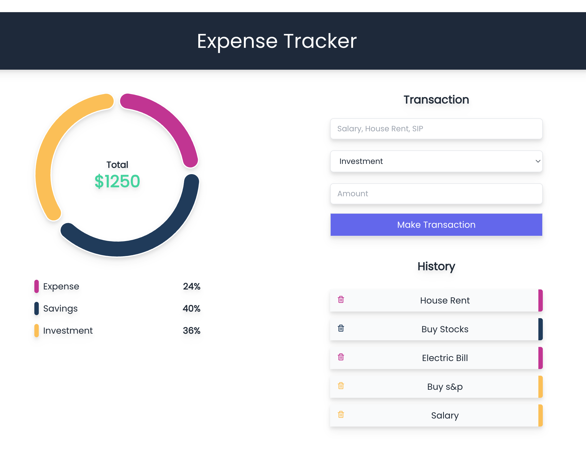

# Personal Expense Tracker with MERN Stack

## Overview

This repository contains the source code for an Expense Tracker application built using the MERN (MongoDB, Express, React, Node) stack. The application is designed to help users manage and track their expenses efficiently.

## Front End 

### Technologies Used

- **MongoDB Atlas**: Cloud-based database service for storing expense data.
- **Express Framework**: Backend server framework to handle API requests and routes.
- **React**: Frontend library for building interactive user interfaces.
- **Node.js**: JavaScript runtime for server-side development.
- **Redux Toolkit**: State management library for React applications.
- **RTK Query**: Data fetching and caching library for Redux Toolkit.
- **Tailwind CSS**: Utility-first CSS framework for styling.
- **Lodash**: JavaScript utility library for handling arrays, objects, and more.

## Features

- User-friendly interface for managing and tracking expenses.
- Redux Toolkit for efficient state management.
- RTK Query for seamless data fetching and caching.
- Responsive design with Tailwind CSS for a stunning UI.
- Integration with MongoDB Atlas for persistent data storage.
- Utilization of Express framework for server-side functionality.

## Reference

[Tutorial](https://www.youtube.com/watch?v=mhM-blTHBz8)
